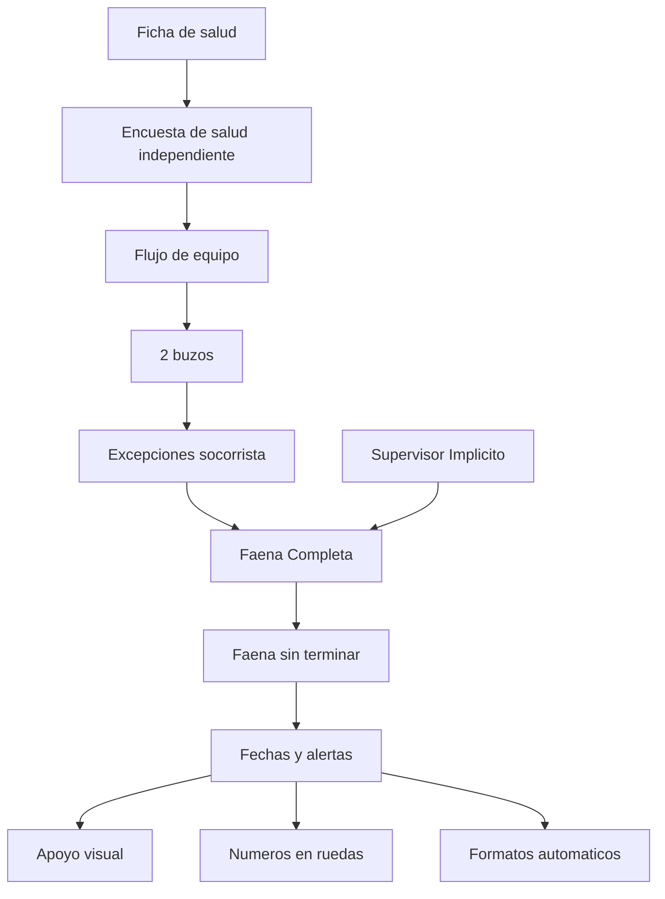

```mermaid
    graph TD
    Salud1[Ficha de salud]-->Salud2
    Salud2[Encuesta de salud independiente]
    Salud2-->Equipo1[Flujo de equipo]-->CdF1
    CdF1[2 buzos]-->CdF2
    CdF2[Excepciones socorrista]-->Faena1
    SI[Supervisor Implicito]-->Faena1
    Faena1[Faena Completa]-->Faena2[Faena sin terminar]-->Qol1
    Qol1[Fechas y alertas]-->Qol2 & Qol3 & Qol4
    Qol2[Apoyo visual]
    Qol3[Numeros en ruedas]
    Qol4[Formatos automaticos]
```